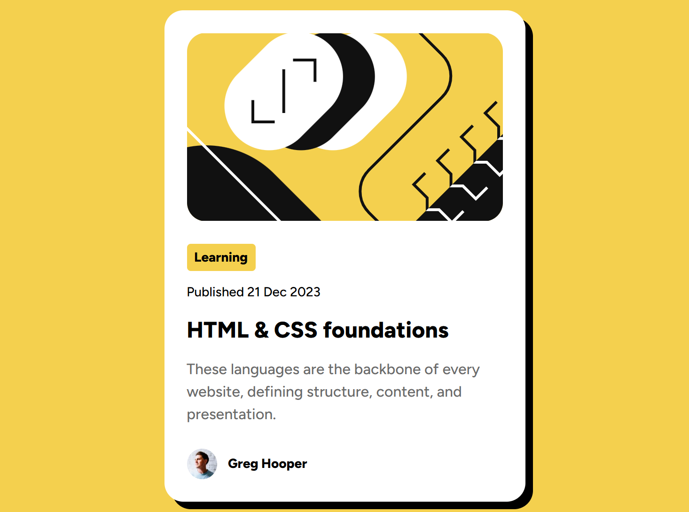

# Frontend Mentor - Blog Preview Card

This is a solution to the [Blog preview card challenge on Frontend Mentor](https://www.frontendmentor.io/challenges/blog-preview-card-ckPaj01IcS).

Frontend Mentor challenges help you improve your coding skills by building realistic projects.

---

## 📸 Screenshot

---

- **Solution URL:** https://github.com/suhaibadill/blog-preview-card?tab=readme-ov-file

- **Live Site URL:** https://suhaibadill.github.io/blog-preview-card/

---

## 🛠 My Process

### Built With

- Semantic HTML5 markup
- CSS custom properties (Variables)
- **Flexbox** (Nested layouts)
- **Fluid Typography** (CSS `clamp()` function)
- Responsive design without Media Queries

---

## 🚀 What I Learned

- How to create **Fluid Typography** using `clamp()` to make text responsive.
- Implementing **Neo-brutalism** design with sharp `box-shadow`.
- Organizing content using **Nested Flexbox** for better spacing control.
- Controlling card responsiveness using `max-width` instead of fixed widths.

---

## 🤖 AI Collaboration

- Used **Gemini (AI)** to understand fluid typography and debug Git conflicts.
- Refined the CSS layout and learned best practices for responsive components.

---

## 👤 Author

- Frontend Mentor: [https://www.frontendmentor.io/profile/suhaibadill](https://www.frontendmentor.io/profile/suhaibadill)
